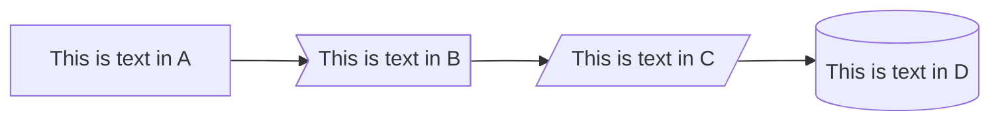
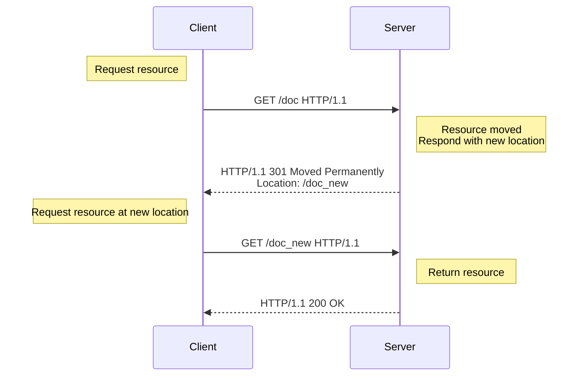

This post should show up with my other blog posts, because `import.meta.glob()` is returning a list of all my posts in order to create my list.

***

## Syntax Highlight Sample

```JavaScript title="partial_permutation.js"
function partial_permutation(pool, require_length) {
  if (require_length <= 0) return [""];
  return pool.map(select => partial_permutation(remove(poll, select), require_length - 1).map(rest => select + rest)).flat()
}
```

## Mermaid Diagram Sample

````md title="test_chart"

````

above code will generate following diagram:



### [MDN shared assets sample](https://github.com/mdn/shared-assets/blob/main/images/diagrams/http/redirections/301-redirection.mmd)

````md title="MDN shared assets sample"

````

will render as following:


